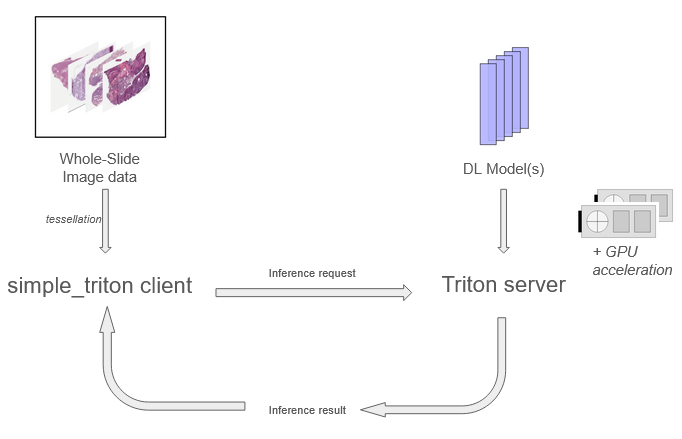

# simple-triton

simple-triton is a Python client for inference with the NVIDIA Triton server. It provides model deployment, configuration, and optimization capabilities for the TensorFlow, ONNX, and Python triton backends directly from Python. This was developed to address limitations of the [PyTriton](https://github.com/triton-inference-server/pytriton) package that only suppports deployments with the Python backend where TensorRT, XLA, and mixed precision are not available.



# User guide <a name="user-guide"></a>

## Contents

- [Quick start](#quick-start)
    - [Example](#example)
    - [Running the Triton container](#container)
- [Command-line interfaces](#cli)
    - [Inference](#inference)
- [Model wrappers](#wrappers)
- [Model configuration](#config)
- [Model control](#control)
- [Developer guide](#developer-guide)
    - [Testing](#testing)
    - [TRT Conversion](#trt)

## Quick start <a name="quick-start"></a>

simple-triton requires `histomcs_stream` and `large_image` packages with the tiff reader
```
git clone https://github.com/PathologyDataScience/simple_triton.git
pip install --editable ./simple_triton
```
> `--editable` ensures that updates to the `simple_triton` package (after `git pull`) immediately takes effect.

Or, you can try the docker image. First, run `git clone` (as above) or make sure to do a `git pull` inside the "simple_triton" directory. Then:  
```bash
# optional: download test data
python download_test_data.py

# simple_triton_client will be the name of the docker image
docker build -f client.Dockerfile . -t simple_triton_client:latest --build-arg DOCKER_GROUP_ID=$(getent group docker | cut -d: -f3)
docker run \
  --security-opt seccomp:unconfined --network=host \
  --rm -it --shm-size=1g \
  -v ${PWD}/test_data:/data:ro \
  --name tritonclient simple_triton_client:latest
```
> **_NOTE:_**  `--network=` lets the docker image see ports from other containers, in this case the host. The default shared memory size is now 64MB, so `--shm-size=` is necessary if you are reading large WSIs. `--security-opt seccomp:unconfined` might only be necessary on bigger machines, but it gives your process access to [openblas](https://www.openblas.net/) threads. `--rm` removes the container on exit, beware.

> The client docker utilizes the server docker network so any ports required by the client must be exposed when launching the _server_ container. For example, running a jupyter notebook on the client requires exposing the jupyter port (8888) on the server using -p <your port>:8888.

### Example <a name="example"></a>

* [feature_extraction](./examples/feature_extraction.ipynb) demonstrates whole-slide image feature extraction.
* [patch_inference](./examples/patch_inference.ipynb) demonstrates feature extraction using a list of images instead of WSIs.
* [export_pytorch_model](./examples/export_pytorch_model.ipynb) demonstrates how to export a PyTorch model to be used with tritonserver.

These examples requires a running tritonserver container on the client machine.

#### Running notebook examples with docker:
This command is similar to the command [given below](#container), but with the addition of the jupyter-lab command, and making it run as your host user.
This launches a jupyter-lab/notebook at port 8888. Copy the URL you see in the console into your web-browser.
```bash
docker run \
  --security-opt seccomp:unconfined --network=host \
  -v ${PWD}/test_data:/data:ro \
  -v ${PWD}/examples:/examples:rw \
  --user $UID --rm -it \
  --shm-size=1g \
  --name tritonclient simple_triton_client:latest \
  bash -c "jupyter-lab --notebook-dir /examples/ --no-browser"
```

### Running the Triton container <a name="container"></a>

simple-triton is tested with [Triton version 25.02](https://github.com/triton-inference-server/server/releases/tag/v2.55.0).
Support for Tensorflow is deprecated in later versions, but other models should still work.

Download and launch the Triton Docker container from the NVIDIA GPU Cloud (NGC). You should be inside of this directory (simple_triton).
```
docker run \
  --gpus=all \
  -d \
  --rm \
  -p 8000:8000 -p 8001:8001 -p 8002:8002 -p 8003:8003 \
  --shm-size=1g \
  --ulimit memlock=-1 \
  --ipc=host \
  -v $PWD/models:/models \
  nvcr.io/nvidia/tritonserver:24.12-py3 \
  tritonserver --model-repository=/models --model-control-mode=explicit --exit-on-error=false
```

This sets the path `./models` as the model repository. The `--model-control-mode=explicit` argument is required to load and modify models at runtime.

> **Note:** The options `--ipc`, `--shm-size`, and `--ulimit memlock` are recommended when using shared memory for client/server communication. This allows Triton to access host shared memory, increasing the default 64MB limit, and prevents paging of RAM out to disk. If running the client in a container then `--ipc` and `--shm-size` should also be used to launch the client container. Running the client container with `--network=host` is the simplest option to allow the client and server to communicate using the host network.

## Command-line interface <a name="cli"></a>
### Inference <a name="inference"></a>
A command-line interface is provided for inference with single or multiple slides and with control of tiling, masking, data loading, and serialization parameters. Models must be loaded prior to inference.

Perform inference with the EfficientNetV2S model on a single slide, outputing serialized embeddings to your home directory
```bash
python feature_extraction.py ~/TCGA-AN-A0G0-01Z-00-DX1.svs ~/ EfficientNetV2S.tensorflow
```

Optional parameters allow restricting inference to a tissue mask (`-m`)
```bash
python feature_extraction.py ~/TCGA-AN-A0G0-01Z-00-DX1.svs ~/ EfficientNetV2S.tensorflow -m TCGA-AN-A0G0-01Z-00-DX1.mask.png
```

Store features in float32 precision rather than default float16 (`-f`)
```bash
python feature_extraction.py ~/TCGA-AN-A0G0-01Z-00-DX1.svs ~/ EfficientNetV2S.tensorflow -f
```

modification tile size (`-t`), add tile overlap (`-o`), and change magnification (`-M`)
```bash
python feature_extraction.py ~/TCGA-AN-A0G0-01Z-00-DX1.svs ~/ EfficientNetV2S.tensorflow -t 256 -o 128 -M 10
```

adjustment of tile reading parameters including ICC correction (`-i`), read chunk size (`-c`), batch size (`-b`), prefetch (`-p`), and multiprocessing workers (`-w`).
```bash
python feature_extraction.py ~/TCGA-AN-A0G0-01Z-00-DX1.svs ~/ EfficientNetV2S.tensorflow -i -c 8 -b 128 -p 2 -w 16
```

Provide image source (`-n`) and target (`-r`) parameters for Macenko color normalization
```bash
python feature_extraction.py ~/TCGA-AN-A0G0-01Z-00-DX1.svs ~/ EfficientNetV2S.tensorflow -n ~/TCGA-AN-A0G0-01Z-00-DX1.stain.npy -r ~/standard_stain.npy
```

Change the address of the Triton inference server
```bash
python feature_extraction.py ~/TCGA-AN-A0G0-01Z-00-DX1.svs ~/ EfficientNetV2S.tensorflow -a "foo.edu:8001"
```

Increase the precision of serialized features to float (default is half float)
```bash
python feature_extraction.py ~/TCGA-AN-A0G0-01Z-00-DX1.svs ~/ EfficientNetV2S.tensorflow -f
```

For large jobs use a tab-delimited file containing input images and optionally their masks and normalization stain profiles
```bash
more ~/inputs.tsv
TCGA-AN-A0G0-01Z-00-DX1.svs    TCGA-AN-A0G0-01Z-00-DX1.mask.py    TCGA-AN-A0G0-01Z-00-DX1.stain.npy    
TCGA-AN-A0G0-01Z-00-DX2.svs    TCGA-AN-A0G0-01Z-00-DX2.mask.py    TCGA-AN-A0G0-01Z-00-DX2.stain.npy
TCGA-AN-A0G0-01Z-00-DX3.svs    TCGA-AN-A0G0-01Z-00-DX3.mask.py    TCGA-AN-A0G0-01Z-00-DX3.stain.npy
TCGA-AN-A0G0-01Z-00-DX4.svs    TCGA-AN-A0G0-01Z-00-DX4.mask.py    TCGA-AN-A0G0-01Z-00-DX4.stain.npy
python feature_extraction.py ~/inputs.tsv ~/ EfficientNetV2S.tensorflow
```

Skip images where output already exists
```bash
python feature_extraction.py ~/inputs.tsv ~/ EfficientNetV2S.tensorflow -s
```

## Model wrappers <a name="wrappers"></a>
simple-triton contains wrappers for serving popular pathology models including CONCH, UNI, gigapath, hibou-L, Phikon, Virchow, and Virchow2 on the [Python backend](https://docs.nvidia.com/deeplearning/triton-inference-server/user-guide/docs/python_backend/README.html). All models are served using mixed precision.

| Model | Input | Output | Size |
|---|---|---|---|
| [conch](https://huggingface.co/MahmoodLab/CONCH) | (224, 224, 3) | 512 | 0.802 GB |
| [gigapath](https://huggingface.co/prov-gigapath/prov-gigapath) | (224, 224, 3) | 1536 | 4.54 GB |
| [hibou-L](https://huggingface.co/histai/hibou-L) | (224, 224, 3) | 1024 | 1.21 GB |
| [phikon](https://huggingface.co/owkin/phikon) | (224, 224, 3) | 768 | 0.346 GB |
| [uni](https://huggingface.co/MahmoodLab/UNI) | (224, 224, 3) | 1024 | 1.21 GB |
| [uni2](https://huggingface.co/MahmoodLab/UNI2-h) | (224, 224, 3) | 1536 | 2.73 GB |
| [virchow](https://huggingface.co/paige-ai/Virchow) | (224, 224, 3) | 2560 | 2.53 GB |
| [virchow2](https://huggingface.co/paige-ai/Virchow2) | (224, 224, 3) | 2560 | 2.53 GB |

A [dockerfile](server.Dockerfile) built on Triton Server container encapsulates all requirements for serving these models
```bash
docker build -t model-tritonserver -f server.Dockerfile .
```

Each folder in the `/models` directory contains a `model.py` file containing the logic for model loading, inference, and cleanup. The `model.py` files need to be copied into the model repository for serving (a `config.pbtxt` file is not required)

```plaintext
    models
    └── phikon                  # Phikon model folder
        └── 1                   # version 1
            └── model.py        # TritonPythonModel Class adapted for Phikon
```


### Huggingface tokens
A [huggingface token](https://huggingface.co/settings/tokens) is required to access the UNI, gigapath, and hibou-L models. This is passed to the server by setting the environment variable `HF_TOKEN` on the server, and passing the environment variable when running the 
```bash
export HF_TOKEN=hf_**********************************
docker run \
  -e HF_TOKEN=$HF_TOKEN \
  --gpus=all \
  -p 8000:8000 -p 8001:8001 -p 8002:8002 -p 8003:8003 \
  --shm-size=1g --ulimit memlock=-1 --ipc=host \
  -v ${PWD}/models/:/models \
  model-tritonserver tritonserver --model-repository=/models --model-control-mode=explicit --exit-on-error=false
```

## Model configuration <a name="config"></a>
`simple_triton.config` contains model configuration classes that implement backend-specific configuration options. These classes enable configuration of batching behavior, specification of model input/output shapes and types, and backend optimizations. See the Triton documentation on [model configuration](https://docs.nvidia.com/deeplearning/triton-inference-server/user-guide/docs/user_guide/model_configuration.html#model-configuration) and [optimization](https://docs.nvidia.com/deeplearning/triton-inference-server/user-guide/docs/user_guide/optimization.html) for more details.

Configuration classes like `PythonConfiguration` and `TensorflowConfiguration` take as inputs additional data classes that configure batching and caching behavior, hardware resources, and model input/output signatures.

When Triton is launched with the `--strict-model-config=false` the server will automatically configure basic information like the input/output signatures and the configuration can omit these
```python
from simple_triton.config import TensorflowConfig
from simple_triton.model import TritonModel
name = "mymodel.tensorflow"
config = TensorflowConfig(name, max_batch_size=64)
model = TritonModel(name, "localhost:8001")
model.load(config=config.json())
```

Alternatively, model inputs and output signatures can be defined using the `ModelInput` and `ModelOutput` classes
```python
from simple_triton.config import ModelInput
input = [ModelInput(name="input_0", shape=[224, 224, 3], dtype=np.float32, optional=False)]
config = TensorflowConfig(name, max_batch_size=64, input=input)
```
Variable sized input dimensions can be indicated using a value of -1. 

The `InstanceGroup` class configures the use of CPU or GPU resources GPU resources and the number of model instances hosted on each GPU 
```python
from simple_triton.config import InstanceGroup
instances = InstanceGroup(count=2, kind="gpu", gpus=[0,1,2,3])
config = TensorflowConfig(name=name, instance_group=instances)
```

`TensorflowOptimization` can be used with `TensorflowMixedPrecision`, `TensorflowXla`, and `TensorRt` to activate automatic mixed precision, XLA compilation, or TensorRT optimization 
```python
from simple_triton.config import TensorflowMixedPrecision, TensorflowXla, TensorflowOptimization
amp = TensorflowMixedPrecision()
xla = TensorflowXla(level=2)
optimizer = TensorflowOptimization(amp=amp, xla=xla)
ampxla_config = TensorflowConfig(name=name, max_batch_size=64, optimization=optimization)
```
TensorRt cannot be used concurrently with XLA and mixed precision.

For a non-batching model, set the maximum batch size to zero
```python
config = TensorflowConfig(name, max_batch_size=0)
```

Configuration classes can also save their configuration to a config.pbtxt for automatic file-based configuration

```python
config.save("/model_repository/mymodel.tensorflow/")
```

File-based configuration is useful for distributing models. When configuring and loading models directly in Python, a JSON formatted dictionary is used. Configuration files use the protocol buffer format. Configuration classes handle conversion between these formats.

## Model control <a name="control"></a>
The `TritonModel` class can be used to load/unload models, to retrieve model configurations or metadata, or to check model if a model is idle or loaded. A model is defined by a model name and server url

```python
from simple_triton.model import TritonModel
model = TritonModel("EfficientNetV2S.tensorflow", "localhost:8001")
```

When unloading a model, simple-triton will check that the model is idle

```python
# load model with auto-generated configuration
# block and timeout after 1 second
model.load(block=True, timeout=1.)
```

Model status can also be checked

```python
# check if model is loaded
assert model.is_loaded()

# check if model is idle
assert model.is_idle()
```

The current hosted model configuration can also be queried

```python
model.get_config()
```

# Inference <a name="inference"></a>

Inference is performed using `inference.inference`. This function consumes data from a simple iterator that emits data/metadata pairs. For single input models, data is provided as a numpy array. For multi-input models, data is provided as a dict of key value pairs linking numpy arrays to model input names (visible from `Model.get_config()`).

`inference` can apply preprocessing functions to data after loading and prior to inference by passing a callable to the `pre` argument. 

> **Note:** For multi-input models all inputs require uniform batch dimensions. Duplicate singleton values where necessary to satisfy this requirement.

# Developer guide <a name="developer-guide"></a>

## Testing <a name="testing"></a>
### Locally
Testing and code formatting is automated using tox and pytest and can be run using `python -m tox run`. Running this will evaluate the tests in the environments defined in `tox.ini` and will format the source using Black. Following testing, a coverage.html file will be located in .tox/coverage.

Testing requires running a Triton server on the local machine. Tests are run using a `EfficientNetV2S.tensorflow` model that can be downloaded using pooch:

```python
import pooch
pooch.retrieve(
    fname="EfficientNetV2S.tensorflow.zip",
    url="https://drive.usercontent.google.com/download?id=1Mmm2sRGzdzCEAODjABiiPIiBdg40EPwC&export=download&confirm=t",
    known_hash="b115917b7d0e480fe080077d60913d90c4b596c5a1e3c74745c22f21ed14df63",
    path=host_model_repository
)
```

### Using standalone docker container
To test using the docker container, launch and build the client as follows:  
```
docker build -f client.Dockerfile . -t simple_triton_client:latest --build-arg DOCKER_GROUP_ID=$(getent group docker | cut -d: -f3)
./launch_test_container.sh
```
You can now run `pytest tests` to run tests inside the container


## TRT Conversion <a name="trt"></a>
Models usually come as PyTorch, tensorflow or ONNX backends. NVIDIA has a format called "TRT" (https://github.com/NVIDIA/TensorRT) that is optimized for inference.
In [examples/resnet50_trt](./examples/resnet50_trt/), we have an example for downloading a PyTorch model, converting it to ONNX, and then converting that file to a TRT backend.
The approach can be modified to work with different types of models. 

Be aware that extra performance is not a guaranteed. 
PyTorch has a lot of optimizations that may not be available in the ONNX or TRT backend.

## Paper results
To reproduce the (TBD) paper: `OUTPUT_DIR="./results" ./benchmarking/paper_benchmarks.sh $OUTPUT_DIR`
Results can be inspected either as tensorboards: `tensorboard --logdir=...`, or as figures:
```bash
# convert tensorboard to CSV
./benchmarking/tensorboard_to_csv.py
# CSV to plot files 
`./benchmarking/tensorboard_csv_to_plot.py`
```

To do the benchmarks using Docker, use the `benchmark_client.Dockerfile` in the benchmarking directory.
It is identical to the `client.Dockerfile` in this directory, except it has access to CUDA so that it can automatically start and stop Triton with GPUs.
To build it from the git root directory: `docker build -f benchmarking/benchmark_client.Dockerfile . -t simple_triton_client:benchmark`
